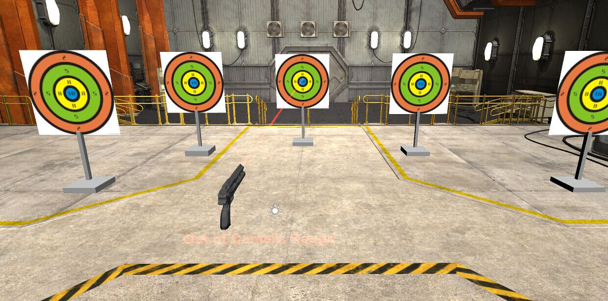

anyshoot
========

Shoot anywhere!

a Oculus AR shooting game, using Smartphone as Gun

- | -
------------- | -------------
who  | @Henry-T, @Arkansol, @hemslo, @boddmg
where  | iHackathon 中美黑客马拉松 Connect to the Future Hackathon
when | 08/08 18:30 - 08/10 18:00
use | Oculus Rift DK1, Unity 3D, 3D printer

Idea:
========

Oculus is an awesome kit, with Oculus DK2 being launched recently, a whole new level of VR is possible. And better VR requires immersive human computer interaction.

_Traditionaly_, we can use Wii, Kinect, Leap Motion or Myo for this kind of task. But as everyone have a smartphone, we figured that we should use smartphone as a motion tracking device. (well, smartphone can be replaced by anything, wearable. things that are **prevalent**)

So on an Android we gather sensor information (like gyroscope) to calculate the motion, and pass motion with other control signals (like fire, reset) through WLAN to game console. And the game is designed with Unity 3D, and use Oculus/Unity intergration plugins to process the message from smartphone.

From our experiment we find the control experience to be smooth and accurate. Then we extended this control capability to anything that uses cursor, so a virtual mouse using the same logic is created, and we played Shoot Duck. Again, awesome!

Demo
========

* Oculus View
  * 
* Environment Setting
  * 
* Game to try with
  * Shoot Duck (classic nintendo game)
* (demo video is being made)
* 

About repo
========
* folder organization
 * 3D-Printer: a toy gun we printed to make it 'real'
 * Android: android app to capture motion
 * Virtual-Mouse: a desktop adapter, writtern in python (tested on Windows and Linux)
 * Unity: contains the anyshoot shooting game, created with Unity
